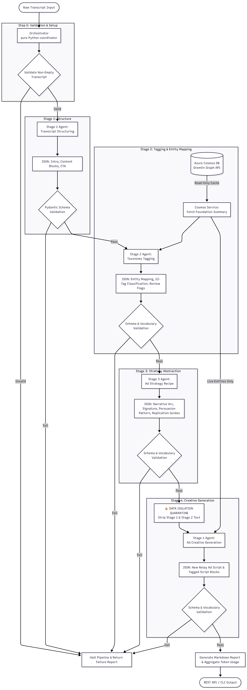
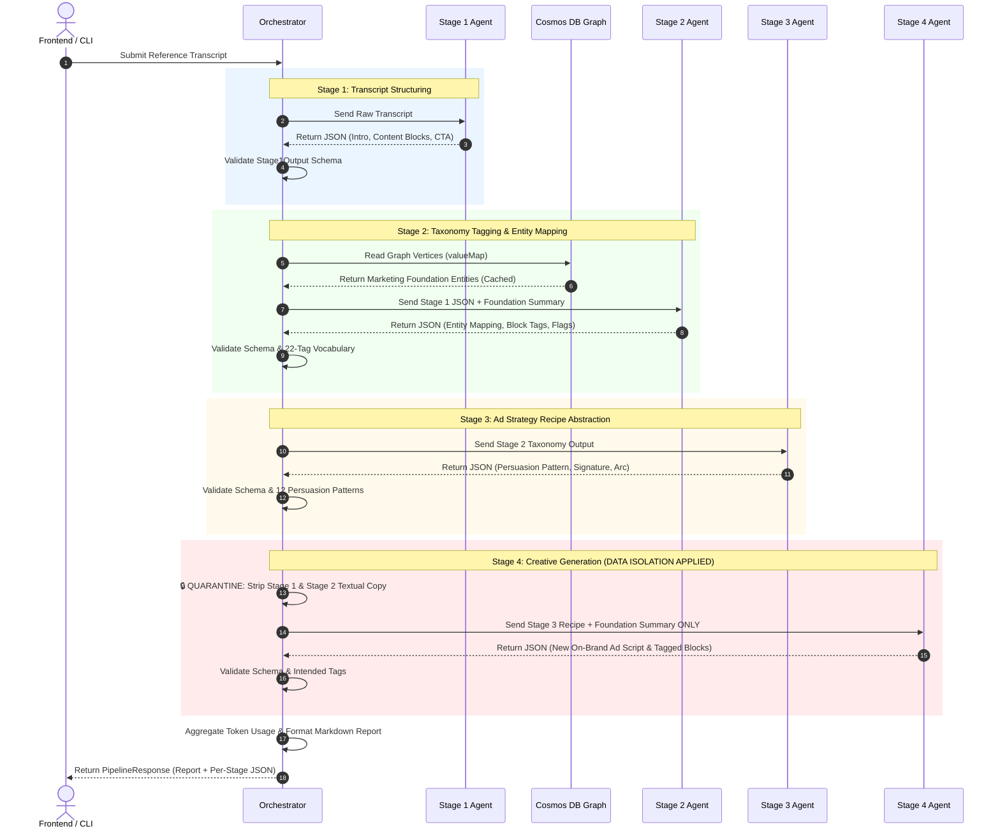

# 🚀 Enterprise AI Ad Pipeline

[](https://www.python.org/downloads/)
[](https://fastapi.tiangolo.com/)
[](https://docs.pydantic.dev/)
[](https://azure.microsoft.com/en-us/products/ai-studio)
[](https://learn.microsoft.com/en-us/azure/cosmos-db/gremlin/)

> An enterprise-grade, multi-agent AI pipeline designed to automate the creation of on-brand advertisements for **any organization** by deconstructing reference competitor transcripts into structured strategic recipes and generating 100% original, high-converting ad scripts grounded in live enterprise graph data.

---

## 📖 Table of Contents

1. [Executive Summary & System Objectives](#1-executive-summary--system-objectives)
2. [End-to-End Pipeline Architecture](#2-end-to-end-pipeline-architecture)
3. [Core Architectural & Data Isolation Rules](#3-core-architectural--data-isolation-rules)
4. [Backend Directory Structure & Module Deep-Dive](#4-backend-directory-structure--module-deep-dive)
   - [Orchestrator (`src/orchestrator.py`)](#41-orchestrator-srcorchestratorpy)
   - [Data Schemas & Contracts (`src/schemas.py`)](#42-data-schemas--contracts-srcschemaspy)
   - [Cosmos DB Foundation Service (`src/services/cosmos.py`)](#43-cosmos-db-foundation-service-srcservicescosmospy)
   - [AI Client Setup (`src/client_setup.py`)](#44-ai-client-setup-srcclient_setuppy)
5. [The Four Stage Agents](#5-the-four-stage-agents)
   - [Stage 1: Transcript Structuring](#51-stage-1-transcript-structuring-srcagentsstage1_agentpy)
   - [Stage 2: Taxonomy Tagging](#52-stage-2-taxonomy-tagging-srcagentsstage2_agentpy)
   - [Stage 3: Ad Strategy Recipe](#53-stage-3-ad-strategy-recipe-srcagentsstage3_agentpy)
   - [Stage 4: Ad Creative Generation](#54-stage-4-ad-creative-generation-srcagentsstage4_agentpy)
6. [FastAPI REST Backend (`api.py`)](#6-fastapi-rest-backend-apipy)
7. [Controlled Vocabularies Reference](#7-controlled-vocabularies-reference)
8. [Installation, Setup & Configuration](#8-installation-setup--configuration)
9. [Running & Testing the Application](#9-running--testing-the-application)
10. [Error Handling, Short-Circuiting & Token Tracking](#10-error-handling-short-circuiting--token-tracking)

---

## 1. Executive Summary & System Objectives

Creating effective paid video and discovery-call advertisements traditionally requires marketers to study reference competitor ads, deconstruct their psychological persuasion hooks, and manually rewrite them using brand-specific tone and messaging. This manual workflow is slow, inconsistent, and heavily dependent on individual institutional knowledge of company messaging, product offerings, and competitor positioning.

The **Enterprise AI Ad Pipeline** automates this workflow using a **four-stage multi-agent architecture** managed by a programmatic, non-LLM Python orchestrator. When presented with a raw reference advertisement transcript, the system produces:
1. **A structured breakdown** of the reference transcript (Intro, Content Blocks, CTA).
2. **A 22-tag taxonomy classification** grounded against real-world entities stored in an **Azure Cosmos DB Gremlin graph**.
3. **An abstract, reusable strategy recipe** that captures the structural persuasion arc without copying original wording.
4. **A brand-new, on-brand advertisement script** generated strictly from the abstract recipe and live enterprise marketing entities.
5. **A comprehensive Markdown report** and raw JSON artifacts for every pipeline stage.

---

## 2. End-to-End Pipeline Architecture

The system operates as a strict linear pipeline where each AI agent specializes in a distinct cognitive phase. The central **Orchestrator** acts as the traffic controller, validating JSON contracts, enforcing controlled vocabularies, and monitoring token consumption.



---

## 3. Core Architectural & Data Isolation Rules

To maintain high content originality and guarantee system reliability, the backend enforces several immutable architectural constraints:

### 🛡️ Rule 1: Separation of Orchestration and Generation
The **Orchestrator** is implemented entirely in pure Python without LLM calls. It is strictly responsible for routing data, executing Pydantic schema validation, enforcing controlled vocabularies, aggregating token metrics, and formatting the final Markdown report. The orchestrator **never** generates copy or reclassifies tags. All intelligent content processing is confined within the four stage agents.

### 🔒 Rule 2: Strict Data Isolation (Quarantine Protocol)
To ensure that generated advertisements are 100% original and not paraphrases or derivative rewrites of reference transcripts, **strict data isolation is enforced between Stage 3 and Stage 4**:
* **Stage 4 receives ONLY:**
  1. `stage3_output`: The abstract strategy recipe (persuasion pattern, tag sequence signature, generic replication instructions).
  2. `foundation_summary`: The live enterprise marketing entities from Azure Cosmos DB.
* **Stage 4 NEVER receives:**
  1. The raw input transcript.
  2. The textual content blocks or summaries from Stage 1.
  3. The block tag text snippets from Stage 2.

### 🚫 Rule 3: Read-Only Database Grounding
All entity mapping in Stage 2 and ad generation in Stage 4 must be grounded in the live **Enterprise Marketing Foundation** stored in Azure Cosmos DB. Hardcoded entity lists are prohibited. The backend connects via the **Gremlin API** using strict **read-only traversal queries** (`g.V().hasLabel(...).valueMap(true)`). Any database mutation operations (`addV`, `addE`, `property`, `drop`) are explicitly forbidden.

### 🛑 Rule 4: Short-Circuit Execution on Failure
Every stage must return JSON conforming precisely to its predefined Pydantic contract and controlled vocabulary sets. If any agent produces invalid JSON, fails Pydantic validation, or hallucinates an unapproved taxonomy tag, the orchestrator **instantly halts the pipeline**. No downstream stages are executed, and a detailed failure report is generated identifying the exact stage, failure reason, and raw output.

---

## 4. Backend Directory Structure & Module Deep-Dive

The repository is structured with a clear separation between API presentation, orchestration logic, schema definitions, agent definitions, and database services.

```text
wokspace/
│
├── main.py                     # CLI entry point for terminal-based pipeline testing
├── api.py                      # FastAPI REST server serving endpoints & static frontend
├── requirements.txt            # Project dependency packages
├── .env                        # Environment variables & database credentials
│
├── src/                        # Core backend package
│   ├── __init__.py
│   ├── client_setup.py         # Azure AI Foundry & OpenAI client initialization
│   ├── orchestrator.py         # Central programmatic pipeline controller
│   ├── schemas.py              # Pydantic validation contracts & controlled vocabularies
│   │
│   ├── agents/                 # AI Stage Agents definitions
│   │   ├── __init__.py
│   │   ├── stage1_agent.py     # Stage 1: Transcript Structuring
│   │   ├── stage2_agent.py     # Stage 2: Taxonomy Tagging & Entity Mapping
│   │   ├── stage3_agent.py     # Stage 3: Ad Strategy Recipe Abstraction
│   │   └── stage4_agent.py     # Stage 4: Ad Creative Script Generation
│   │
│   └── services/               # External integrations
│       ├── __init__.py
│       └── cosmos.py           # Azure Cosmos DB Gremlin graph client & TTL caching
│
└── static/                     # Frontend static web assets
    └── index.html              # Interactive web user interface
```

---

### 4.1. Orchestrator (`src/orchestrator.py`)
The orchestrator is the programmatic backbone of the system. It coordinates the execution lifecycle without relying on probabilistic model behaviors.

* **Primary Function:** `run_pipeline(transcript: str) -> dict`
  * Executes **Step 0**: Validates input whitespace and length.
  * Sequentially invokes `run_stage1()`, `run_stage2()`, `run_stage3()`, and `run_stage4()`.
  * Passes inputs between stages while rigorously respecting data isolation before Stage 4.
* **JSON Sanitization:** Implements `_clean_llm_json(raw: str)` to strip extraneous markdown code fences (e.g., ` ```json ... ``` `) that LLMs occasionally wrap around JSON responses.
* **Vocabulary Enforcement:** Implements dedicated validator functions (`_validate_stage2_vocab`, `_validate_stage3_vocab`, `_validate_stage4_vocab`) that check validated Pydantic models against immutable Python `frozensets`.
* **Report Generation:** Builds structured GitHub-flavored Markdown reports via `_generate_full_report()` on success or `_generate_failure_report()` on validation failure, formatting clear data tables and highlighting review flags.
* **Token Tracking:** Accumulates input, output, and total token usage across all agent calls using `_add_usage()` and embeds a formatted token summary table directly into the final report.

---

### 4.2. Data Schemas & Contracts (`src/schemas.py`)
This module enforces strict data typing and structural integrity across the entire application using **Pydantic v2** models and `frozenset` vocabularies.

#### Core Pydantic Models:
* `Stage1Output`: Validates `intro` (str), `content_blocks` (`list[ContentBlock]`), and `cta` (str).
  * `ContentBlock`: Requires `block_number` (int), `text` (str), and `summary` (str).
* `Stage2Output`: Validates `entity_mapping` (`EntityMapping`), `block_tags` (`list[BlockTag]`), `review_flags` (`list[ReviewFlag]`), and `unmapped_count` (int).
  * `EntityMapping`: Validates graph-grounded fields including `marketing_foundation` (the target organization's foundation name, e.g., `<Your Organization Name>`), `audience`, `product`, `product_messaging`, `icp`, `mapped_problem`, `mapped_value`, `intro_tag`, `cta_tag`, and their respective confidence scores.
  * `BlockTag`: Enforces `block_number`, `text_truncated`, `primary_tag`, optional `secondary_tag`, and `confidence`.
  * `ReviewFlag`: Records `block_number`, `flag_reason` (must match approved 8 reasons), and human-readable `explanation`.
* `Stage3Output`: Validates the abstract recipe structure: `narrative_arc` (str), `persuasion_pattern` (str), `recipe_signature` (`list[str]`), `structural_weighting` (`StructuralWeighting`), `key_themes` (`list[str]`), `replication_instructions` (str), and `strategy_notes` (`list[str]`).
  * `StructuralWeighting`: Divides the signature into `opening_third`, `middle_third`, and `closing_third`.
* `Stage4Output`: Validates `relay_ad_script` (the continuous text script generated for the target organization), `script_blocks` (`list[ScriptBlock]`), and `generation_notes` (str). *(Note: The field name `relay_ad_script` is preserved in the schema for codebase compatibility while representing the generalized brand advertisement).*
  * `ScriptBlock`: Maps each generated section to `block_number`, `text`, and `intended_tag`.

---

### 4.3. Cosmos DB Foundation Service (`src/services/cosmos.py`)
This service manages connection pooling, read-only graph queries, and memory-based caching for the **Enterprise Marketing Foundation** stored in Azure Cosmos DB via the Gremlin API.

* **Gremlin Client Initialization:** `_create_gremlin_client()` configures authentication using `COSMOS_DB_ENDPOINT`, `COSMOS_DB_KEY`, `COSMOS_DB_DATABASE`, and `COSMOS_DB_GRAPH`, utilizing `GraphSONSerializersV2d0()` for message serialization.
* **Graph Traversal & Flattening:** Executes read-only queries across 13 core foundation labels (`MarketingFoundation`, `MarketingAudience`, `ProblemValue`, `ICPModel`, `Product`, `ProductMessaging`, `ProductUseCase`, `ValueDriver`, `Differentiator`, `ProductFeature`, `MarketingTrigger`, `Competitor`). Uses `_flatten_value_map()` to convert Gremlin's standard list-wrapped property values (e.g., `{"name": ["Staff Hosting"]}`) into clean, single-value dictionaries.
* **Configurable TTL Caching:** Implements an in-memory cache managed by `_is_cache_valid()` and `invalidate_cache()`. Results are stored for `FOUNDATION_CACHE_TTL_SECONDS` (default: 300 seconds) to prevent redundant database queries during sequential pipeline runs.
* **Prompt Injection Formatting:** Implements `get_foundation_summary(foundation_data: dict) -> str` which transforms raw graph vertices into a structured Markdown summary. It explicitly instructs stage agents to select real entity **names** (e.g., *"Cloud Migration Services"* or *"Staff Augmentation"*) rather than generic graph labels (e.g., *"MarketingAudience"*).
* **Debug Utility:** Provides `debug_dump_foundation()` to output truncated JSON snapshots of graph responses for diagnostic inspection.

---

### 4.4. AI Client Setup (`src/client_setup.py`)
Establishes authenticated connections to Azure AI Foundry and initializes the underlying model deployment clients.

* Resolves environment configuration from `.env` at the project root.
* Authenticates with Azure using `DefaultAzureCredential()` and initializes `AIProjectClient` connected to `PROJECT_CONNECTION_STRING`.
* Exposes a shared, thread-safe `openai_client = project_client.get_openai_client()` and exports `MODEL_DEPLOYMENT_NAME` (defaulting to `gpt-4o-mini` or `gpt-4o`) for use across all stage agents.

---

## 5. The Four Stage Agents

Each AI stage agent is initialized via `_create_or_update_agent()` using `PromptAgentDefinition` from `azure.ai.projects.models` and invoked via `openai_client.responses.create()`.



---

### 5.1. Stage 1: Transcript Structuring (`src/agents/stage1_agent.py`)
* **Agent Name:** `stage1-transcript-structuring`
* **Objective:** Deconstructs raw transcript text into sequential content blocks without altering original phrasing.
* **Input:** Raw transcript string.
* **Output:** JSON matching `Stage1Output`.
* **System Instructions Highlights:**
  * Strict prohibition against rewriting or paraphrasing.
  * Identifies natural semantic transitions to assign sequential `block_number`s.
  * Isolates the opening hook into `intro` and closing call-to-action into `cta`.
  * Generates concise one-line summaries for each content block.
* **Usage Extraction:** Implements `_extract_usage()` to capture prompt tokens, completion tokens, and total tokens from `response.usage`.

---

### 5.2. Stage 2: Taxonomy Tagging (`src/agents/stage2_agent.py`)
* **Agent Name:** `stage2-taxonomy-tagging`
* **Objective:** Performs dual-phase classification mapping the structured ad to the organization's database entities and categorizing each block against a controlled 22-tag taxonomy.
* **Input:** `Stage1Output` JSON dictionary + formatted Cosmos DB `foundation_summary`.
* **Output:** JSON matching `Stage2Output`.
* **System Instructions Highlights:**
  * **Phase 1 (Entity Mapping):** Selects exact entity names from the foundation data for `marketing_foundation`, `audience`, `product`, `product_messaging`, and `icp`. Predicts `mapped_problem` and `mapped_value` by matching transcript pain points against graph `ProblemValue` vertices.
  * **Phase 2 (Block Tagging):** Evaluates each content block to assign a `primary_tag` from the 22 approved tags, an optional `secondary_tag` for multi-theme blocks, and a `confidence` level (`high`, `medium`, `low`).
  * **Review Flags Generation:** Automatically raises flags using the 8 approved reason codes (e.g., `ambiguous_tag`, `low_confidence`, `entity_not_in_foundation`) whenever block categorization is uncertain.
  * Tracks total `unmapped_count` for blocks tagged as `uncategorized`.

---

### 5.3. Stage 3: Ad Strategy Recipe (`src/agents/stage3_agent.py`)
* **Agent Name:** `stage3-ad-strategy-recipe`
* **Objective:** Abstracts the structural persuasion blueprint from the tagged ad while stripping 100% of the original transcript wording.
* **Input:** `Stage2Output` JSON dictionary.
* **Output:** JSON matching `Stage3Output`.
* **System Instructions Highlights:**
  * **Zero Original Wording Rule:** Explicitly forbidden from retaining reference transcript language; produces pure structural blueprints.
  * **Persuasion Pattern Classification:** Categorizes the ad under one of the **12 approved persuasion patterns** (e.g., `problem_solution`, `testimonial_driven`, `comparison`).
  * **Recipe Signature Construction:** Builds an ordered sequence of taxonomy tags representing the flow from hook to closing CTA (`[intro_tag, block_1_tag, block_2_tag, ..., cta_tag]`).
  * **Structural Weighting:** Divides the signature into `opening_third`, `middle_third`, and `closing_third` to analyze pacing and thematic distribution.
  * **Replication Instructions:** Formulates step-by-step, generic writing instructions for downstream creative teams or AI agents.

---

### 5.4. Stage 4: Ad Creative Generation (`src/agents/stage4_agent.py`)
* **Agent Name:** `stage4-ad-creative-generation`
* **Objective:** Writes a brand-new, high-converting advertisement for **the target organization** by executing the Stage 3 recipe using live database marketing entities.
* **Input:** `Stage3Output` (Recipe) + Cosmos DB `foundation_summary` (**Data Isolation Enforced**).
* **Output:** JSON matching `Stage4Output`.
* **System Instructions Highlights:**
  * **Originality Mandate:** Must write 100% original copy tailored specifically to the organization's products, features, value drivers, and audience pain points.
  * **Signature Execution:** Follows the exact tag sequence defined in `recipe_signature`. Each tag in the sequence becomes a dedicated paragraph/section in the new script.
  * **Entity Integration:** Dynamically weaves in real brand differentiators, use cases, and messaging variants from the graph database summary.
  * **Script Block Breakdown:** Returns both the continuous script (`relay_ad_script`) and a block-by-block breakdown (`script_blocks`) mapping each section back to its `intended_tag`.

---

## 6. FastAPI REST Backend (`api.py`)

The REST API provides an asynchronous interface for frontend client interaction and programmatic execution. To prevent asyncio event loop conflicts between FastAPI's uvloop/asyncio loop and `gremlinpython`'s synchronous/aiohttp transport, the pipeline is executed in a separate worker thread using `asyncio.to_thread()`.

### Endpoints Specification:

| Method | Endpoint | Description | Response Model / Type |
| :--- | :--- | :--- | :--- |
| `POST` | `/api/pipeline` | Submits a raw transcript and runs the full 4-stage pipeline. | `PipelineResponse` (JSON) |
| `GET` | `/api/download/report` | Downloads the latest generated Markdown report as a file attachment. | `text/markdown` (`.md`) |
| `GET` | `/api/download/json` | Downloads the latest full pipeline result as a JSON attachment. | `application/json` (`.json`) |
| `GET` | `/api/stage/{stage_num}`| Retrieves the validated JSON output for a specific stage (`1`, `2`, `3`, or `4`). | `dict` (JSON) |
| `GET` | `/` | Serves the interactive HTML frontend user interface from `/static/index.html`. | `HTMLResponse` |

### `PipelineResponse` JSON Schema:
```json
{
  "status": "success | failed",
  "timestamp": "2026-07-02T12:30:00.000000+00:00",
  "report": "# Ad Pipeline Report\n\n## Status: All Stages Complete ✅...",
  "stage_1_output": { "intro": "...", "content_blocks": [...], "cta": "..." },
  "stage_2_output": { "entity_mapping": {...}, "block_tags": [...], "review_flags": [...] },
  "stage_3_output": { "narrative_arc": "...", "persuasion_pattern": "...", "recipe_signature": [...] },
  "stage_4_output": { "relay_ad_script": "...", "script_blocks": [...], "generation_notes": "..." },
  "error": null,
  "token_usage": {
    "per_stage": {
      "stage_1": { "input_tokens": 450, "output_tokens": 320, "total_tokens": 770 },
      "stage_2": { "input_tokens": 1200, "output_tokens": 550, "total_tokens": 1750 }
    },
    "total": { "input_tokens": 3800, "output_tokens": 2100, "total_tokens": 5900 }
  }
}
```

---

## 7. Controlled Vocabularies Reference

The pipeline strictly enforces controlled vocabularies. Any stage output attempting to use values outside these sets triggers an immediate pipeline halt.

### 🏷️ Primary Taxonomy Tags (22 Tags)
Used in Stage 2 (`primary_tag`, `secondary_tag`, `intro_tag`, `cta_tag`), Stage 3 (`recipe_signature`, `structural_weighting`), and Stage 4 (`intended_tag`).

| Tag | Description | Tag | Description |
| :--- | :--- | :--- | :--- |
| `audience` | Target market or persona | `icp` | Ideal Customer Profile definition |
| `problem` | Customer pain point or challenge | `icp_experience` | Operational experience of the ICP |
| `value` | Core value proposition delivered | `competitor` | Direct or indirect competitor mention |
| `product` | Specific product or service offering | `brand_positioning`| High-level brand identity or mission |
| `product_messaging`| Dedicated messaging pillar | `social_proof` | Case studies, metrics, or testimonials |
| `feature` | Functional capability or feature | `objection_handling`| Preemptive resolution of doubts/costs |
| `benefit` | Positive outcome of a feature | `process_descriptor`| Explanation of how the service works |
| `differentiator` | Unique selling point vs. market | `offer` | Pricing, discount, or consultation offer|
| `use_case` | Specific operational application | `call_to_action` | Explicit instructions on next steps |
| `value_driver` | Underlying economic value driver | `urgency` | Time-sensitive motivation to act |
| `marketing_trigger`| External event prompting purchase | `uncategorized` | Content not matching any known tag |

### 🧠 Persuasion Patterns (12 Patterns)
Used in Stage 3 (`persuasion_pattern`) to classify the strategic arc.

```text
problem_solution    |  testimonial_driven  |  feature_led    |  benefit_led
urgency_led         |  comparison          |  storytelling   |  offer_led
objection_handling_led |  process_led      |  brand_led      |  hybrid
```

### 🚩 Review Flag Reasons (8 Reasons)
Used in Stage 2 (`review_flags.flag_reason`) to flag content requiring human auditing. *(Note: `non_relay_company` in the schema represents flagging content that references an external or competitor brand rather than the target organization).*

```text
low_confidence           |  uncategorized_block      |  entity_not_in_foundation
ambiguous_tag            |  missing_cta_context      |  unclear_intro
non_relay_company        |  weak_entity_match
```

### 📊 Confidence Levels (3 Levels)
```text
high  |  medium  |  low
```

---

## 8. Installation, Setup & Configuration

### Prerequisites
1. **Python 3.10+** installed on your system.
2. **Azure AI Foundry Account** with an active Project and deployed OpenAI model (e.g., `gpt-4o` or `gpt-4o-mini`).
3. **Azure Cosmos DB Account** configured with the **Gremlin API** and populated with your organization's Marketing Foundation graph vertices.

### Step-by-step Installation

1. **Clone the repository and navigate to the project root:**
   ```bash
   git clone https://github.com/<your-organization>/ai-ad-pipeline.git
   cd ai-ad-pipeline/wokspace
   ```

2. **Create and activate a Python virtual environment:**
   ```bash
   # On Windows (PowerShell)
   python -m venv venv
   .\venv\Scripts\Activate.ps1

   # On macOS/Linux
   python3 -m venv venv
   source venv/bin/activate
   ```

3. **Install required dependencies:**
   ```bash
   pip install -r requirements.txt
   ```

4. **Configure Environment Variables:**
   Create a `.env` file in the root directory (`wokspace/.env`) and add your Azure credentials:
   ```env
   # Azure AI Foundry / AI Projects Configuration
   PROJECT_CONNECTION_STRING="<your-azure-ai-project-connection-string>"
   MODEL_DEPLOYMENT_NAME="gpt-4o-mini"

   # Azure Cosmos DB (Gremlin Graph API) Configuration
   COSMOS_DB_ENDPOINT="wss://<your-cosmos-account>.gremlin.cosmos.azure.com:443/"
   COSMOS_DB_KEY="<your-cosmos-db-primary-or-secondary-key>"
   COSMOS_DB_DATABASE="<your-database-name>"
   COSMOS_DB_GRAPH="<your-graph-name>"

   # Service Configuration
   FOUNDATION_CACHE_TTL_SECONDS=300
   ```

---

## 9. Running & Testing the Application

### Option A: Command-Line Interface (CLI) Execution
To run an end-to-end test of the pipeline without starting the web server, use `main.py`. This executes `run_pipeline()` against a built-in advertisement sample transcript and prints the JSON artifacts and Markdown report to the terminal.

```bash
python main.py
```

### Option B: Starting the FastAPI Web Server
To launch the backend API and serve the interactive web frontend:

```bash
uvicorn api:app --reload --host 0.0.0.0 --port 8000
```

* **Web UI:** Open your browser and navigate to [http://localhost:8000/](http://localhost:8000/)
* **Interactive API Docs (Swagger UI):** Navigate to [http://localhost:8000/docs](http://localhost:8000/docs)
* **ReDoc API Documentation:** Navigate to [http://localhost:8000/redoc](http://localhost:8000/redoc)

---

## 10. Error Handling, Short-Circuiting & Token Tracking

### Short-Circuit Halting Mechanics
The orchestrator wraps each agent execution in robust exception and validation handling blocks:
1. **Model Validation:** When an LLM returns raw text, `_clean_llm_json()` strips markdown formatting, and `StageXOutput.model_validate_json()` parses the structure.
2. **Vocabulary Auditing:** `_validate_stageX_vocab()` inspects every parsed tag against approved sets.
3. **Immediate Halt:** If a `ValidationError`, `JSONDecodeError`, or vocabulary violation occurs at Stage $N$, the pipeline logs the stack trace, captures the raw unparsed text, and terminates immediately. Stages $N+1$ through $4$ are never invoked.

### Failure Report Anatomy
On failure, the API returns HTTP 200 (or HTTP 500 on unhandled server faults) with `status: "failed"` and a generated diagnostic report:
```markdown
# Ad Pipeline Report

## Status: FAILED ❌
**Generated at:** 2026-07-02 12:35:00 UTC

---
### Stage 1: Transcript Structuring — ✅ SUCCESS
**Blocks:** 3 | **CTA:** Book your free discovery call today...

### Stage 2: Taxonomy Tagging — ❌ FAILED
**Reason:** Stage 2 controlled vocabulary violations:
  - Block 2: primary_tag 'cost_reduction' is not approved.
  - intro_tag_confidence 'super_high' is not valid.

**Raw Agent Output:**
```json
{ "entity_mapping": { ... }, "block_tags": [ ... ] }
```

---
### Stages 3–4: Not executed (pipeline halted at Stage 2)
```

### Token Usage Aggregation
Every call to `openai_client.responses.create()` returns token metrics within `response.usage`. The `_extract_usage()` helper captures:
* `input_tokens` (prompt tokens + injected foundation summary tokens)
* `output_tokens` (generated JSON completion tokens)
* `total_tokens`

The orchestrator maintains an in-memory accumulator (`total_usage`) and maps per-stage metrics into `per_stage_usage`. This data is embedded into the JSON response (`token_usage`) and appended as a formatted markdown table at the bottom of the final report, enabling precise cost monitoring and prompt optimization.

---
*Built with structure, strict data isolation, and programmatic orchestration for enterprise marketing teams.*
